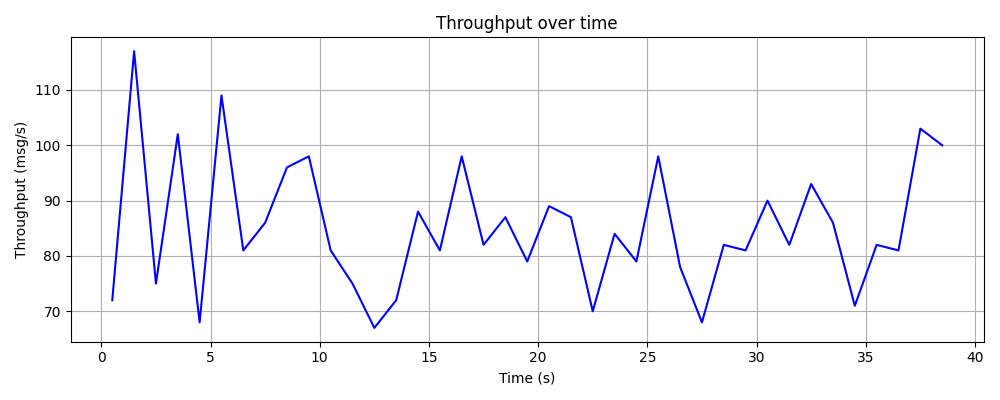
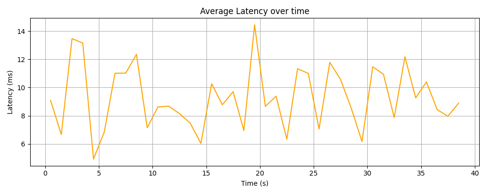
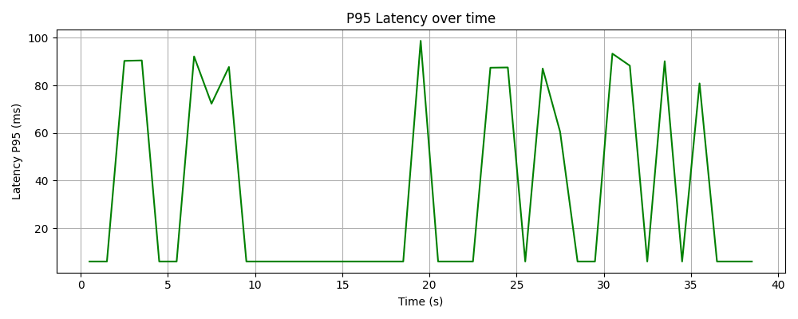

# PubG1
*A minimal distributed log system inspired by Apache Kafka*  

---

## What is this Project?  
**PubG1 is a minimal distributed log system built from scratch** to demonstrate the core ideas behind Apache Kafka.  
It implements the following features step by step:  

- Brokers that accept publishes and serve consumers  
- Partitioning of logs for scalability  
- Replication with leader/follower model for fault tolerance  
- Replication with dynamic leader election for fault tolerance via raftos
- Consumer groups with offset tracking  
- A stream analytics layer (windowed aggregations, checkpointing)  
- Benchmarking with load generation and fault injection  

The goal was **not to recreate Kafka fully**, but to learn and showcase the architectural principles that make Kafka robust: log‑based messaging, partition leaders, replication, dynamic leader election in times of failures, consumer offsets, and fault‑tolerant stream processing.  

---

## Sprint Breakdown  
- **Sprint 0** → Scaffolding: repo layout, Docker Compose skeleton, single broker with in‑memory + disk log.  
- **Sprint 1** → Partitioning, simple producer & consumer.  
- **Sprint 2** → Replication: leader/follower with static metadata, failover logic, dynamic leader election via Raft.  
- **Sprint 3** → Consumer groups & offsets stored in leader.  
- **Sprint 4** → Stream analytics layer: windowed counts + checkpointing.  
- **Sprint 5** → Testing & benchmarks: load generator, latency/throughput metrics, fault injection.  

---

## Architecture (Simplified)  


- **Leader** receives writes and replicates to **3 followers**  
- **Consumers** read from the committed log (after quorum replication)  
- **Offsets** are tracked per consumer group  
- **Stream processor** consumes logs to compute aggregates  

---

## Running the Scripts

You can **test PubG1 yourself** using the Python benchmark scripts or compare with a standard Kafka cluster using Docker.

---

### 1. Test PubG1 Sprint 5 Benchmark (Python)

1. **Start 4 brokers** in separate terminals (ports 8000–8003):

    ```
    BROKER_PORT=8001 python -m broker.run_broker 8001 8000 8001 8002 8003
    BROKER_PORT=8000 python -m broker.run_broker 8000 8001 8001 8002 8003
    BROKER_PORT=8002 python -m broker.run_broker 8002 8000 8001 8002 8003
    BROKER_PORT=8003 python -m broker.run_broker 8003 8000 8001 8002 8003

    ```

    Repeat for ports 8001, 8002, 8003.

2. Run the Sprint 5 benchmark script:

    ```
    PARTITION=0 GROUP_ID=bench DURATION_SEC=40 TARGET_RPS=100 python test_sprint_7.py
    ```

    What happens:
    - A consumer is started that tracks offsets and computes end-to-end latency.
    - A load generator publishes messages at the configured **TARGET_RPS**.
    - Faults are injected: leader and follower brokers will be killed and restarted automatically.
    - Metrics summary is printed, including throughput, publish/consume latency, and errors.

    **Tip:** Adjust `DURATION_SEC` and `TARGET_RPS` to simulate longer runs or heavier load.

---

### 2. Test with Docker-Based Kafka

1. Start Kafka cluster via Docker Compose:

    ```
    docker-compose up -d
    ```

2. Create a benchmark topic:

    ```
    docker exec -it kafka1 \
      kafka-topics.sh --create \
      --topic bench \
      --partitions 1 \
      --replication-factor 1 \
      --bootstrap-server localhost:9092
    ```

3. Run the Kafka benchmark runner:

    ```
    PARTITION=0 GROUP_ID=bench DURATION_SEC=40 TARGET_RPS=100 python kafka_benchmark_runner.py
    ```

    What happens:
    - Messages are produced and consumed from the Kafka cluster.
    - Metrics similar to the PubG1 Python benchmark are collected.
    - You can adjust script parameters in `kafka_benchmark_runner.py` to match duration, rate, and partitions for comparison.

    **Tip:** Both methods allow you to observe throughput, publish latency, end-to-end latency, and fault recovery. The Python benchmark additionally demonstrates dynamic leader election when brokers fail.


---

## Results (Sprint 5 Benchmarks)  

- **Throughput:** ~85 msgs/sec sustained  
- **Publish Latency:** avg ~4–6 ms  
- **End‑to‑End Latency:** avg ~100 ms, 95% under 200 ms  
- **Recovery:** leader/follower failures injected, system recovered gracefully with no data loss  

### Example Plots  
Throughput over time:  
  

Average Latency:  
  

P95 Latency:  
  

---
## Kafka vs PubG1

| Feature | Apache Kafka | PubG1 |
|---------|--------------|-----------|
| Scale | Production-grade, supports thousands of brokers & partitions | Minimal cluster, 4 brokers, educational purposes |
| Replication | Leader/follower with configurable replication factor | Leader/follower with dynamic leader election |
| Consumer Groups | Fully-featured, offset storage in Kafka | Consumer groups with offset tracking in leader |
| Stream Processing | Kafka Streams, high-throughput, distributed | Minimal stream analytics with windowed aggregation & checkpointing |
| Fault Tolerance | Handles large-scale failures gracefully | Demonstrates fault recovery, leader/follower failover, no data loss in tests |
| Complexity | Full production setup, requires Zookeeper or KRaft | Minimal, lightweight, easy to run locally |
| Learning Value | Black-box for many users, high entry barrier | Transparent architecture for understanding Kafka principles, step-by-step implementation |

## Metrics Comparison: Kafka vs PubG1  

| Metric | Apache Kafka (typical) | PubG1 (Sprint 5 Benchmarks) |
|--------|------------------------|--------------------------------|
| Throughput | Thousands to millions msgs/sec | ~85 msgs/sec sustained |
| Publish Latency | 1–5 ms (avg) | 4-6 ms (avg) |
| End-to-End Latency | 5–50 ms (avg) | 100 ms (avg), 95% under 200 ms |
| Fault Recovery | Automatic, handles large-scale failures | Demonstrated with leader/follower crashes, recovered gracefully |
| Data Loss | None in normal operation | None observed in tests |
| Cluster Size | 100s–1000s of brokers | 4 brokers |
| Stream Processing | High-throughput, distributed (Kafka Streams) | Minimal, windowed aggregation with checkpointing |

> **Note:** PubG1 is intentionally minimal to demonstrate core Kafka principles in an educational setting. Despite smaller scale, it maintains **correct replication, offset tracking, and fault recovery**, making it ideal for learning and experimentation.


> **Takeaway:** PubG1 is not trying to replace Kafka, but it distills Kafka’s key concepts into a runnable, educational system, highlighting replication, dynamic leader election, consumer offsets, and fault tolerance in a minimal and understandable form.

---

## Conclusion  

PubG1 demonstrates that replication, dynamic leader election, failover, and consumer offset tracking can be implemented in a minimal system.  
The benchmarks show that even under fault injection (leader/follower crashes):

- **Throughput** was sustained at expected levels.  
- **Publish latency** remained low.  
- **End-to-end latency** recovered smoothly after failures.  
- **No data loss** occurred — confirming correct replication and offset handling.  

This project achieved its initial goal: to build a **minimal, educational Kafka-like system** that can be run locally and stress-tested for availability and durability.


---

## Future Work  
- More advanced consumer rebalancing  
- Stronger distributed coordination (e.g., etcd/ZooKeeper)  
- Higher throughput via batching and async replication  

---
